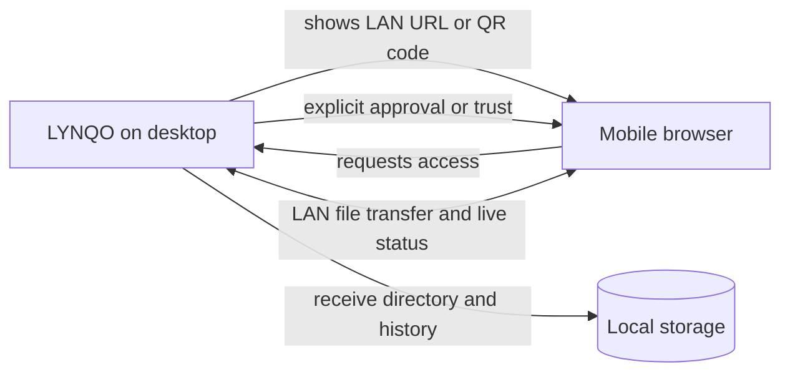

<p align="center">
  
</p>

<h1 align="center">LYNQO</h1>

<p align="center">
  <a href="README.md">简体中文</a> · <strong>English</strong>
</p>

<p align="center">
  <strong>Connect nearby. Transfer freely.</strong><br />
  An open-source, cross-device file transfer tool for trusted local networks.
</p>

<p align="center">
  <a href="https://github.com/Map1eBr1dge/lynqo/actions/workflows/ci.yml"></a>
  <a href="LICENSE"></a>
  
  
</p>

## What problem does it solve?

Moving files between a phone and a computer often means signing in to a cloud drive, installing multiple clients, accepting rate limits, or handing sensitive files to a third-party server. LYNQO keeps transfers on the current LAN between devices that you explicitly authorize: start the service on a desktop computer, scan the connection address from a phone, approve the device on the desktop, then send or receive files in either direction.

LYNQO is not cloud storage, remote backup, content moderation, or anti-virus software. Back up important files yourself, and verify unknown files before opening them.

## ✨ Highlights

- **QR connection with desktop approval** — a mobile browser requests access after scanning a connection address; the desktop user can approve once or trust the device.
- **Two-way transfer** — send files from a phone to a desktop or accept desktop-initiated transfers on a phone. The user always chooses the files and target device.
- **One transfer center** — see active, completed, failed, and pending transfers in one place.
- **Live status and integrity checks** — progress, speed, remaining time, and a short verification fingerprint are available; expand it to view the full SHA-256 value.
- **Local-first data** — device records, authorization state, and transfer history stay on the desktop host. Files are not uploaded to a public cloud.
- **Open and auditable** — LYNQO is released under GPL-3.0-only. Anyone who redistributes a modified or binary version must comply with the same license and corresponding-source requirements.

## 🔄 How it works



1. Start LYNQO on the desktop and confirm that its status says it is running.
2. Select **Connect device**, then scan the QR code from a phone or enter the complete LAN address in the phone browser.
3. When the desktop shows an authorization request, verify the device and network, then choose **Approve** or **Trust device**.
4. Choose files and a target device on either side. Follow live progress and results in the **Transfer Center**.

> Do not enter `localhost` or `127.0.0.1` on a phone: those addresses point to the phone itself, not the desktop. Use LYNQO only on the same trusted, non-isolated LAN.

## 🚀 Quick start

### Prerequisites

- Node.js 20 or later
- Rust stable toolchain
- The Tauri build dependencies for your platform; Windows commonly needs MSVC Build Tools and WebView2
- A desktop computer and at least one mobile device on the same LAN

### Run from source

```bash
git clone https://github.com/Map1eBr1dge/lynqo.git
cd lynqo
npm ci
npm run tauri dev
```

The installer displays the GPL-3.0 license. On first desktop launch, LYNQO also asks the user to read and acknowledge its terms, privacy notice, and risk notice.

### Build an installer

```bash
npm run tauri build
```

On Windows, the NSIS installer is written to:

```text
src-tauri/target/release/bundle/nsis/
```

Download published installers from [Releases](https://github.com/Map1eBr1dge/lynqo/releases). The publishing workflow can provide Windows (`.exe` / `.msi`), macOS (`.dmg` for Intel and Apple Silicon), and Linux x64 (`.AppImage` / `.deb`) installers. macOS and Linux packages are built by GitHub Actions on their respective operating systems.

### Zero-configuration default

Normal use needs no `.env` file, fixed IP address, token, database address, or operator details. After a device scans the QR code, the web client uses the current connection address to reach the desktop host.

Only set this optional value when deploying the frontend behind a custom API gateway:

```bash
VITE_LYNQO_API_BASE_URL=https://your-gateway.example
```

## 🛠️ Technology

| Area | Technology |
| --- | --- |
| Desktop application | Tauri 2, Rust |
| Frontend | Vue 3, TypeScript, Vite, Pinia |
| LAN service | Axum, Tokio, WebSocket, mDNS |
| Local data | SQLite |
| File transfer | Chunked transfer, resumable transfer, SHA-256 verification |

## 🧪 Verification and quality

```bash
# Frontend type check and production build
npm run build

# Rust formatting, static analysis, and tests
cd src-tauri
cargo fmt --check
cargo clippy --all-targets --all-features -- -D warnings
cargo test
```

GitHub Actions runs these checks for pushes to `main` and for pull requests, then builds Windows and macOS installer artifacts. To publish macOS and Linux packages, manually run `Publish Desktop Installers` in Actions with an existing Release tag; it attaches Intel/Apple Silicon macOS and Linux x64 installers directly to that Release.

## 🧭 Project structure

```text
src/                 Vue UI, routes, stores, and browser-facing services
src-tauri/src/       Rust commands, LAN service, transfer engine, and local storage
src-tauri/icons/     Desktop and mobile icon assets
.github/workflows/   Continuous integration and cross-platform builds
```

## 🤝 Contributing

Bug reports with reproducible steps, documentation improvements, tests, and focused feature patches are welcome.

1. Search [Issues](https://github.com/Map1eBr1dge/lynqo/issues) before opening a new report.
2. Fork the repository and create a topic branch from `main`.
3. Run the verification commands before opening a pull request.
4. Explain the problem, the change, and the verification evidence in the pull request.

Read the full [Contribution Guide (English)](CONTRIBUTING.en.md) or [贡献指南（简体中文）](CONTRIBUTING.md).

## 👤 Author and further information

- Maintainer: [Map1eBr1dge](https://github.com/Map1eBr1dge)
- Project home: [github.com/Map1eBr1dge/lynqo](https://github.com/Map1eBr1dge/lynqo)
- In-app documentation: **Settings → Open-source license and agreements**

## 📄 License

Copyright (C) 2026 LYNQO contributors.

LYNQO is licensed under the [GNU General Public License v3.0](LICENSE) (`GPL-3.0-only`). See [THIRD_PARTY_LICENSES.md](THIRD_PARTY_LICENSES.md) for third-party licenses.
