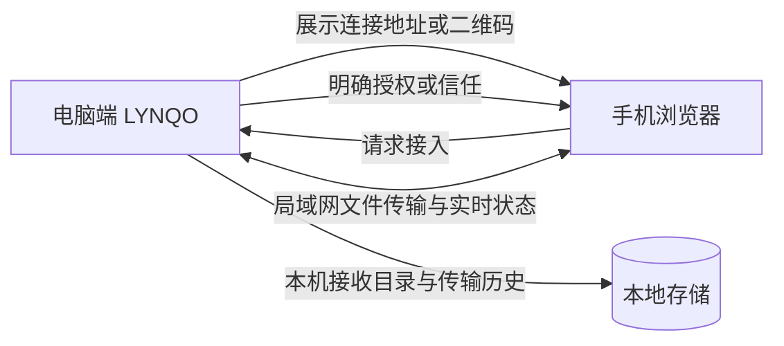

<p align="center">
  
</p>

<h1 align="center">LYNQO</h1>

<p align="center">
  <strong>连接附近，自由传输。</strong><br />
  一个面向可信局域网的开源跨设备文件传输工具。
</p>

<p align="center">
  <a href="https://github.com/Map1eBr1dge/lynqo/actions/workflows/ci.yml"></a>
  <a href="LICENSE"></a>
  
  
</p>

## 它解决什么问题？

在手机与电脑之间传文件，往往意味着登录云盘、安装多个客户端、忍受限速，或把敏感文件交给第三方服务器。LYNQO 将传输限制在你明确授权的设备与当前局域网内：电脑端启动服务、手机扫描连接地址、电脑确认接入，然后双方即可发送或接收文件。

LYNQO 不是云盘、远程备份、内容审核或杀毒服务。重要文件请自行备份；未知来源文件请先核验并使用安全软件检查。

## ✨ 亮点特性

- **扫码接入，桌面端确认**：移动浏览器扫描连接地址后，电脑端会出现授权请求；可选择一次授权或信任设备。
- **双向文件传输**：手机可向电脑发送，也可接收电脑发起的传输；发送前始终由用户选择文件和目标设备。
- **传输中心**：集中查看进行中、已完成、失败与待处理的传输，不让多个列表互相干扰。
- **实时状态与完整性校验**：显示进度、速度、剩余时间和简短校验指纹；需要时可展开完整 SHA-256。
- **本地优先**：设备记录、授权状态与传输历史保存在运行 LYNQO 的电脑；文件不上传到公共云端。
- **开源且可审计**：项目按 GPL-3.0-only 发布，任何发布修改版或二进制版的人都必须遵守同许可证和对应源代码提供义务。

## 🔄 使用流程



1. 在电脑启动 LYNQO，确认顶部状态显示“运行中”。
2. 点击“连接设备”，用手机扫描二维码，或在手机浏览器输入完整局域网地址。
3. 电脑端出现授权请求后，确认设备名称与网络环境，再选择“授权”或“信任设备”。
4. 在手机或电脑选择文件与目标设备，随后在“传输中心”查看实时进度与结果。

> 请不要在手机输入 `localhost` 或 `127.0.0.1`；那会指向手机自身，而不是电脑。只在可信、未隔离的同一局域网内使用。

## 🚀 快速开始

### 前置条件

- Node.js 20 或更高版本
- Rust stable 工具链
- 对应平台的 Tauri 构建依赖；Windows 通常需要 MSVC Build Tools 和 WebView2
- 一台电脑与至少一台处于同一局域网的移动设备

### 从源码运行

```bash
git clone https://github.com/Map1eBr1dge/lynqo.git
cd lynqo
npm ci
npm run tauri dev
```

首次安装会展示 GPL-3.0 许可证；桌面端第一次启动时还会要求阅读并确认使用协议、隐私说明和免责声明。

### 构建安装包

```bash
npm run tauri build
```

Windows 安装包会生成在：

```text
src-tauri/target/release/bundle/nsis/
```

### 零配置默认值

正常使用不需要创建 `.env`，也不需要填写 IP、Token、数据库地址或运营主体信息。扫描二维码后，网页端默认使用当前连接地址与电脑端通信。

仅当你把前端部署到自定义 API 网关时，才可在 `.env` 中按需设置：

```bash
VITE_LYNQO_API_BASE_URL=https://your-gateway.example
```

## 🛠️ 技术栈

| 领域 | 技术 |
| --- | --- |
| 桌面应用 | Tauri 2、Rust |
| 前端 | Vue 3、TypeScript、Vite、Pinia |
| 局域网服务 | Axum、Tokio、WebSocket、mDNS |
| 本地数据 | SQLite |
| 文件能力 | 分片传输、断点续传、SHA-256 校验 |

## 🧪 验证与质量

```bash
# 前端类型检查与生产构建
npm run build

# Rust 格式、静态检查与测试
cd src-tauri
cargo fmt --check
cargo clippy --all-targets --all-features -- -D warnings
cargo test
```

GitHub Actions 会在推送到 `main` 或提交 Pull Request 时执行这些检查，并构建 Windows 与 macOS 安装产物。

## 🧭 项目结构

```text
src/                 Vue 界面、路由、状态与前端服务
src-tauri/src/       Rust 命令、局域网服务、传输与本地存储
src-tauri/icons/     桌面与移动端图标资源
.github/workflows/   持续集成与跨平台构建
```

## 🤝 参与贡献

欢迎提交 Bug 报告、可复现步骤、文档改进、测试或功能补丁。

1. 先在 [Issues](https://github.com/Map1eBr1dge/lynqo/issues) 搜索是否已有相同问题。
2. Fork 仓库并从 `main` 创建主题分支。
3. 提交前运行上面的验证命令。
4. 创建 Pull Request，清晰说明问题、改动和验证结果。

更完整的提交规范请阅读 [CONTRIBUTING.md](CONTRIBUTING.md)。

## 👤 作者与了解更多

- 发起与维护：[Map1eBr1dge](https://github.com/Map1eBr1dge)
- 项目主页：[github.com/Map1eBr1dge/lynqo](https://github.com/Map1eBr1dge/lynqo)
- 产品内说明：设置 → 开源许可与协议

## 📄 许可证

Copyright (C) 2026 LYNQO contributors.

本项目采用 [GNU General Public License v3.0](LICENSE)（`GPL-3.0-only`）。第三方组件许可证见 [THIRD_PARTY_LICENSES.md](THIRD_PARTY_LICENSES.md)。
